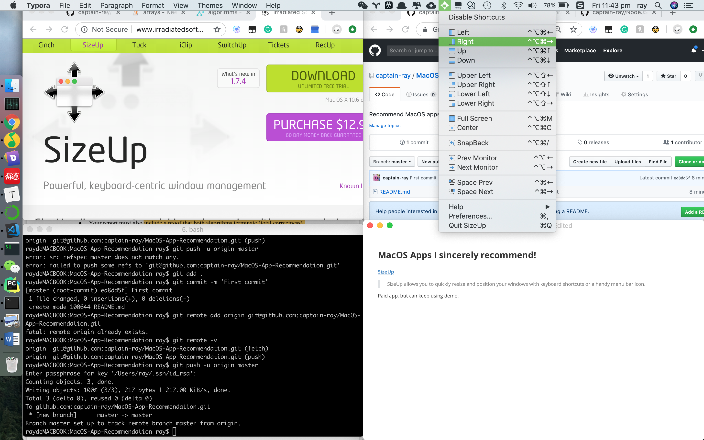
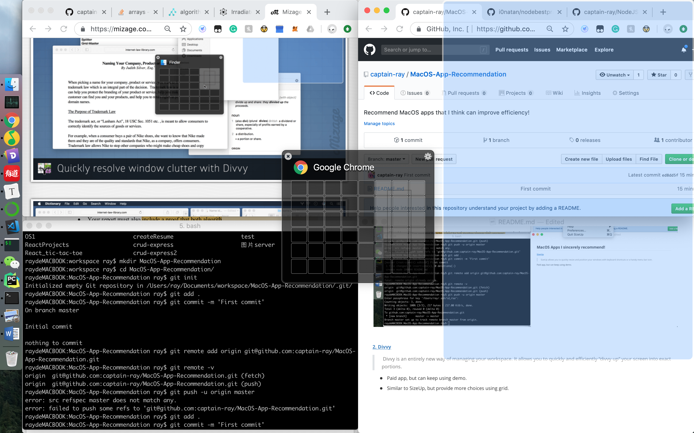
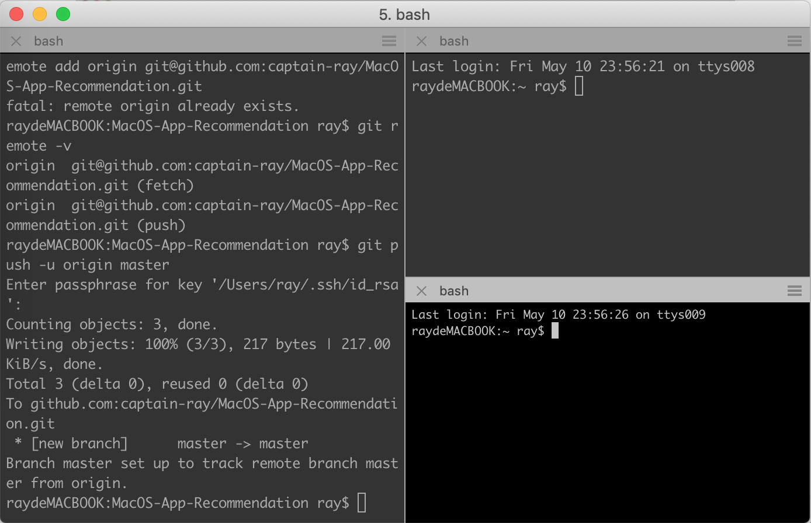
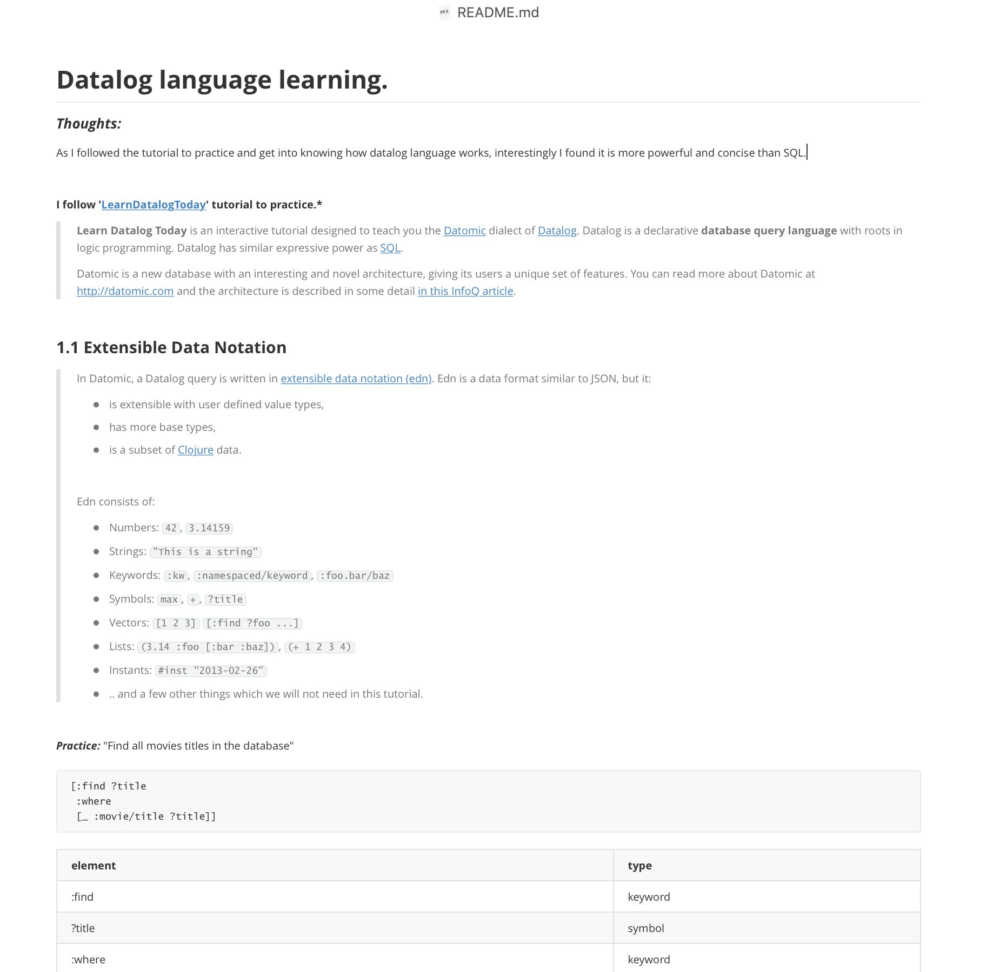

## MacOS Apps I sincerely recommend!

##### [1. SizeUp]([http://www.irradiatedsoftware.com/sizeup/](http://www.irradiatedsoftware.com/sizeup/)) 

> SizeUp allows you to quickly resize and position your windows with keyboard shortcuts or a handy menu bar icon.

- Paid app, but can keep using demo.

##### [2. Divvy](https://mizage.com/divvy/)

>  Divvy is an entirely new way of managing your workspace. It allows you to quickly and efficiently “divvy up” your screen into exact portions.

- Paid app, but can keep using demo. 
- Similar to SizeUp, but provide more choices using grid.

##### [3. iTerm2](https://www.iterm2.com/)

> iTerm2 is a replacement for Terminal and the successor to iTerm. iTerm2 brings the terminal into the modern age with features you never knew you always wanted.

[Features](https://www.iterm2.com/features.html)

- powerful than 'Terminal'
- Split Panes functionality  really improves efficiency

##### [4. Typora](https://typora.io/)

Powerful, consice and clean Markdown Editor, like what I am editting this README.md right now!

 

